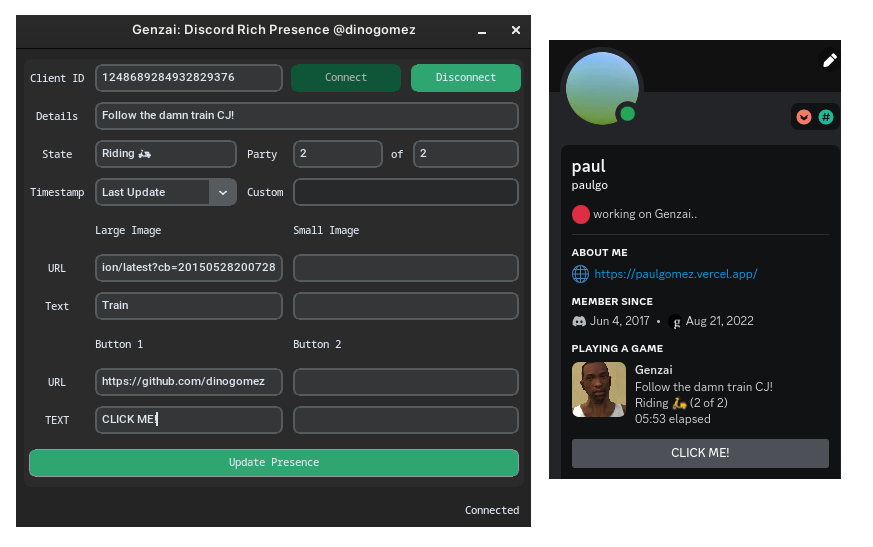

<p align="center">


</p>

---

A lightweight Discord custom Rich Presence manager made for Linux. Built with [CustomTkinter](https://github.com/TomSchimansky/CustomTkinter) and [pypresence](https://github.com/qwertyquerty/pypresence), heavily inspired by [maximmax42/Discord-CustomRP](https://github.com/maximmax42/Discord-CustomRP).

<p align="center">

</p>

## Installation

```bash
pyinstaller --noconfirm --onedir --windowed --icon "<Genzai Location>/Genzai/assets/genzai.ico" --add-data "<CustomTkinter Location>/customtkinter:customtkinter/" --add-data "<Genzai Location>/Genzai/assets:assets/" --hidden-import "PIL._tkinter_finder"  "<Genzai Location>/Genzai/genzai.py"
```
